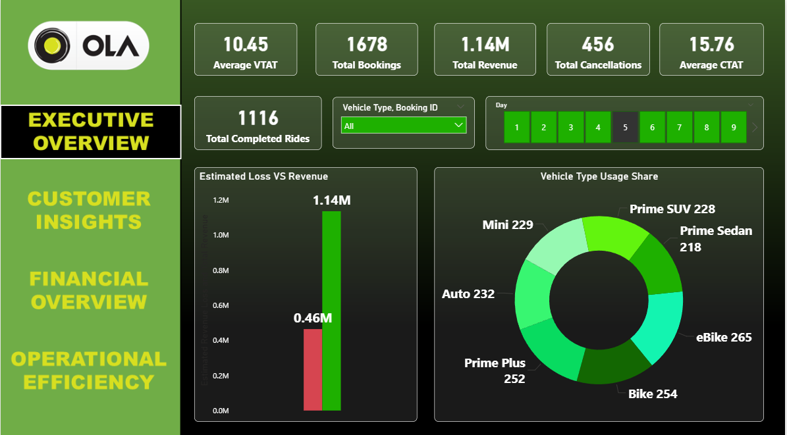
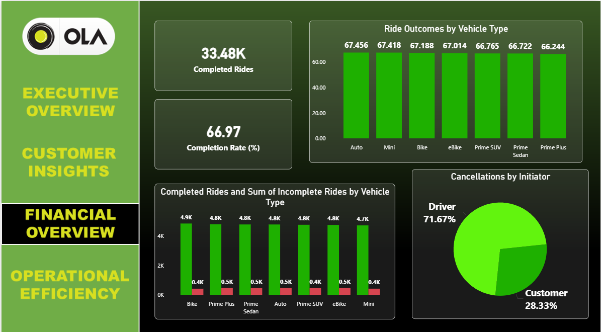
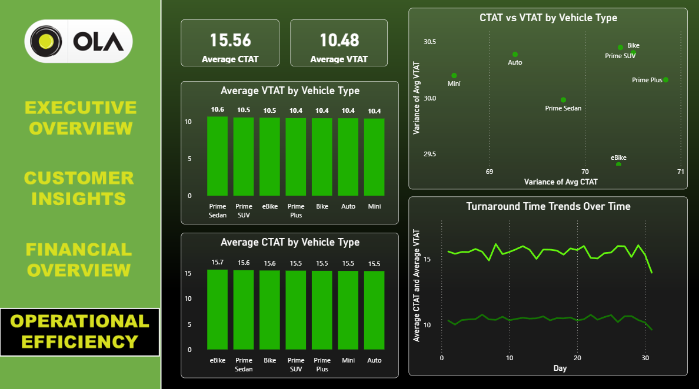

# ola-ride-analysis-powerbi-sql

# 🚕 Ola Ride Analysis – Power BI & PostgreSQL Project

This project provides an end-to-end data analysis pipeline for Ola Ride Booking Data, using **PostgreSQL** for data processing, **Python** for automation, and **Power BI** for visualization.

---

## 📌 Problem Statement

Ride-sharing platforms like Ola generate massive volumes of booking and operational data. This project aims to:
- Identify **operational bottlenecks**
- Discover **revenue leakage**
- Understand **customer behavior**
- Improve **ride efficiency and turnaround time**

---

## 📂 Dataset

- Source: `Bengaluru_Ola_data_updated.csv`
- Contains booking records including:
  - Vehicle Type
  - Booking Status
  - Customer Ratings
  - Pickup/Drop Locations
  - VTAT / CTAT
  - Cancellations, Incomplete Rides, Revenue data

---

## 🧠 What I Did

✅ Cleaned and analyzed the dataset using **PostgreSQL**  
✅ Designed **20+ SQL views** to extract KPIs & trends  
✅ Created a **4-page interactive Power BI dashboard**  
✅ Incorporated **charts, KPIs, and drill-downs** to present findings  
✅ Used **DAX measures** for completion rate and turnaround time  
✅ Automated Excel reporting using **Python + Pandas**

---

## 💻 Dashboard Overview

### 📊 Page 1: Exclusive Overview
- KPIs: Total Bookings, Completed Rides, Avg VTAT/CTAT
- Charts: Revenue vs Estimated Loss, Bookings Trend, Vehicle Distribution  


---

### 📍 Page 2: Customer Insights
- KPIs: Total Customers, Repeat Customers
- Charts: Top Pickup & Drop Locations, Cancellation Reasons  


---

### ⚙️ Page 3: Functional Overview
- Completed vs Incomplete Rides by Vehicle
- Cancellation by Driver vs Customer  


---

### ⏱️ Page 4: Operational Efficiency
- Avg VTAT/CTAT by Vehicle Type
- CTAT vs VTAT Scatter  


---

🎥 **Dashboard Walkthrough Video**  
📽️ [Download Dashboard Video](./Dashbord/Dashbord_video.mp4)

---

## 💡 Key Insights

- Routes with highest cancellation rates help focus quality/service
- Estimated revenue loss due to cancellations can guide policy changes
- Customer satisfaction zones highlight service areas needing attention
- Time-based demand can optimize driver allocation

---

## 🔄 Data Processing Automation

To streamline reporting and visualization, I automated the conversion of multiple SQL-generated `.csv` files into Excel workbooks using Python and `pandas`.

Each CSV was added as a separate sheet in its respective `.xlsx` file. The script:
- Validates if the file exists
- Skips empty CSVs
- Automatically adjusts column widths for readability

### 🐍 Python Script Preview:
```python
with pd.ExcelWriter("Operational_Efficiency_Insights.xlsx") as writer:
    for csv in ["average_VTAT_and_CTAT.csv", ...]:
        df = pd.read_csv(csv)
        df.to_excel(writer, sheet_name=os.path.splitext(csv)[0], index=False)
```

➡️ Full script is available in the repo under:  
📁 `Tables/data_to_excel_generator.py`

---

## 🚀 Tools Used

- 📊 Power BI  
- 🐘 PostgreSQL (via pgAdmin)  
- 📁 Excel (for summary export)  
- 🐍 Python (Pandas & XlsxWriter)

---

## 📚 What I Learned

- Writing efficient SQL views for complex KPIs
- Building dynamic dashboards with interlinked visuals
- Designing clean, story-driven dashboards
- Real-world problem solving with business impact

---

## 🌐 Real-World Relevance

Ridesharing companies can use similar dashboards for:
- Driver performance
- Customer retention
- Operational improvement
- Revenue forecasting

---

## 📧 Contact

**Arnab Mondal**  
📧 arnabmondal2509@gmail.com  
🔗 [LinkedIn](https://www.linkedin.com/in/arnabmondal2509) | [Portfolio](https://arnab2509.github.io/)
