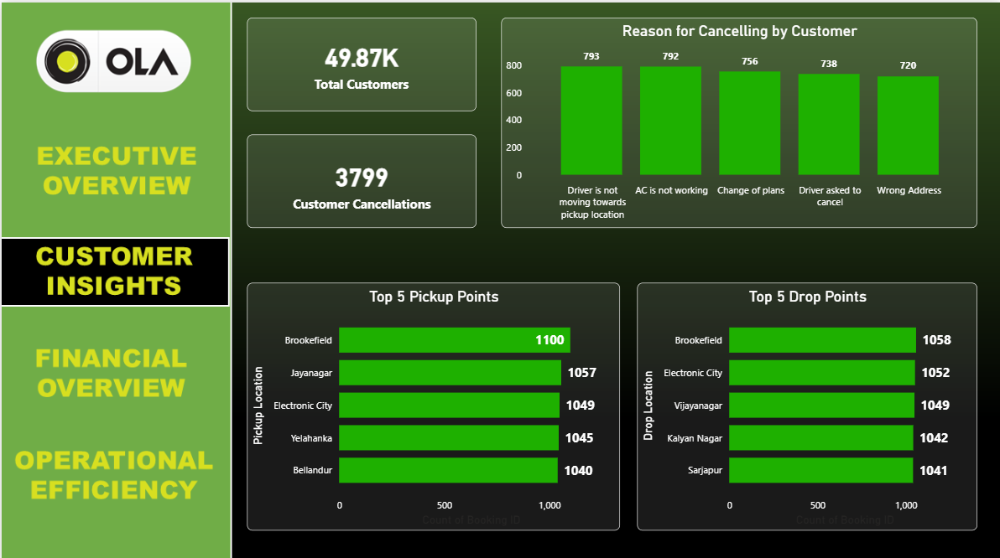

# 🚕 Ola Ride Analysis – Power BI & PostgreSQL Project

This project provides an end-to-end data analysis pipeline for Ola Ride Booking Data, using **PostgreSQL** for data processing, **Python** for automation, and **Power BI** for visualization.

---

## 📌 Problem Statement

Ride-sharing platforms like Ola generate massive volumes of booking and operational data. This project aims to:

* Identify **operational bottlenecks**
* Discover **revenue leakage**
* Understand **customer behavior**
* Improve **ride efficiency and turnaround time**

---

## 📂 Dataset

* Source: `Bengaluru_Ola_data_updated.csv`
* Contains booking records including:

  * Vehicle Type
  * Booking Status
  * Customer Ratings
  * Pickup/Drop Locations
  * VTAT / CTAT
  * Cancellations, Incomplete Rides, Revenue data

---

## 🧠 What I Did

✅ Cleaned and analyzed the dataset using **PostgreSQL**
✅ Designed **20+ SQL views** to extract KPIs & trends
✅ Created a **4-page interactive Power BI dashboard**
✅ Incorporated **charts, KPIs, and drill-downs** to present findings
✅ Used **DAX measures** for completion rate and turnaround time
✅ Automated Excel reporting using **Python + Pandas**

---

## 💻 Dashboard Overview

### 📊 Page 1: Exclusive Overview

* KPIs: Total Bookings, Completed Rides, Avg VTAT/CTAT
* Charts: Revenue vs Estimated Loss, Bookings Trend, Vehicle Distribution
  

---

### 📍 Page 2: Customer Insights

* KPIs: Total Customers, Repeat Customers
* Charts: Top Pickup & Drop Locations, Cancellation Reasons
  

---

### ⚙️ Page 3: Functional Overview

* Completed vs Incomplete Rides by Vehicle
* Cancellation by Driver vs Customer
  

---

### ⏱️ Page 4: Operational Efficiency

* Avg VTAT/CTAT by Vehicle Type
* CTAT vs VTAT Scatter
  

---

🎥 **Dashboard Walkthrough Video**
📽️ [Download Dashboard Video](./Dashbord/Dashbord_video.mp4)

---

## 💡 Key Insights

* Routes with highest cancellation rates help focus quality/service
* Estimated revenue loss due to cancellations can guide policy changes
* Customer satisfaction zones highlight service areas needing attention
* Time-based demand can optimize driver allocation

---

## 🛠 Business Problems It Can Solve

1. Detect high cancellation routes to improve driver allocation & service quality
2. Quantify and address revenue loss from incomplete rides
3. Optimize pickup & drop hotspot allocation to meet demand
4. Improve turnaround times (VTAT/CTAT) for better fleet utilization
5. Increase customer retention through satisfaction analysis

---

## 🚀 Potential & Impact

1. Enable real-time monitoring of ride efficiency and revenue
2. Support data-driven driver incentive and penalty policies
3. Reduce operational costs by optimizing resource allocation
4. Improve customer satisfaction through targeted improvements
5. Scale the model to multiple cities and integrate with live APIs

---

## 🔄 Data Processing Automation

To streamline reporting and visualization, I automated the conversion of multiple SQL-generated `.csv` files into Excel workbooks using Python and `pandas`.

Each CSV was added as a separate sheet in its respective `.xlsx` file. The script:

* Validates if the file exists
* Skips empty CSVs
* Automatically adjusts column widths for readability

### 🐍 Python Script Preview:

```python
with pd.ExcelWriter("Operational_Efficiency_Insights.xlsx") as writer:
    for csv in ["average_VTAT_and_CTAT.csv", ...]:
        df = pd.read_csv(csv)
        df.to_excel(writer, sheet_name=os.path.splitext(csv)[0], index=False)
```

➡️ Full script is available in the repo under:
📁 `Tables/data_to_excel_generator.py`

---

## 🚀 Tools Used

* 📊 Power BI
* 🐘 PostgreSQL (via pgAdmin)
* 📁 Excel (for summary export)
* 🐍 Python (Pandas & XlsxWriter)

---

## 📚 What I Learned

* Writing efficient SQL views for complex KPIs
* Building dynamic dashboards with interlinked visuals
* Designing clean, story-driven dashboards
* Real-world problem solving with business impact

---

## 🌐 Real-World Relevance

Ridesharing companies can use similar dashboards for:

* Driver performance
* Customer retention
* Operational improvement
* Revenue forecasting

---

## 📧 Contact

**Arnab Mondal**
📧 [arnabmondal2509@gmail.com](mailto:arnabmondal2509@gmail.com)
🔗 [LinkedIn](https://www.linkedin.com/in/arnabmondal2509) | [Portfolio](https://arnab2509.github.io/)

